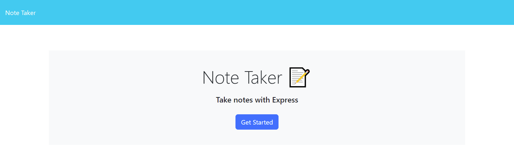
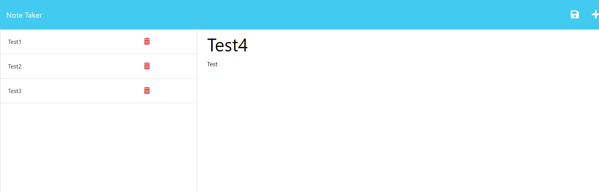

# README Note Taker App 
  
## Description

The function of this application is to save notes. The application will use an Express.js backend to save and pull notes in a JSON file.

Future development of this application will allow the Enter key to save and disable Add until a previously saved note is selected.

## Screenshots

## Links

Git Hub: Unavailable at this moment
Heroku: https://notetaker-dw-36368a18a05b.herokuapp.com/

